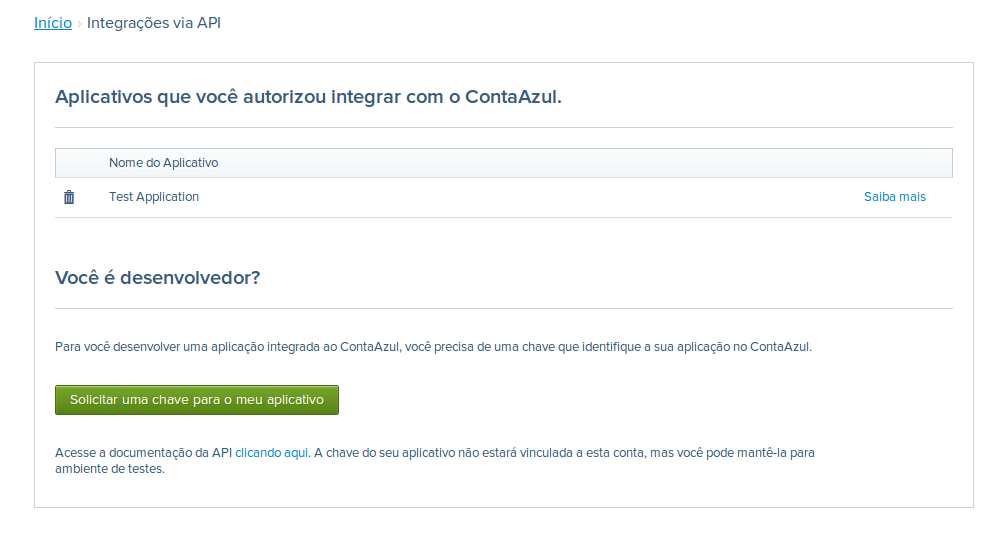

# ContaAzul API 

Este documento foi escrito com o intuito de ajudar os desenvolvedores de
aplicações a se comunicarem com o ContaAzul. Ele possui o detalhamento
mínimo necessário para que sejam realizadas as primeiras integrações com
a plataforma do ContaAzul.


[Entendendo o Protocolo](#h.319aow2chbvr)

[Obtendo os registros](#h.5tf50d38fq75)

[Criando registros](#h.ne42b8oxc97x)

[Atualizando registros](#h.f8yoy7v6wseg)

[Removendo registros](#h.x31pp920q0wn)

[Entendendo o modelo de autenticação da API](#h.fa2gc5fzc13q)

[Como conseguir uma chave para o meu aplicativo?](#h.sayb4oe8wbus)

[Como integrar os meus clientes com o ContaAzul ?](#h.7k9h14vt0um9)

[Sobre as entidades](#h.yypi8rbff6us)

[Entendendo o conceito de negociações do ContaAzul](#h.t5go0yfifdv5)

[Overview das entidades que envolvem negociações](#h.80vx0eufi7xq)

[Negociação de Venda de Serviço](#h.315qce7mz1j2)

[Regras de Negócio Expostas](#h.4dn6a83fv253)

[Clientes](#h.hvr8ve3589st)

[Vendedor](#h.fwyhf16o5qcy)

[Transportadora](#h.svhyhk8wpmu5)

[Cidades](#h.ahq4mdbf5y66)

[Bancos](#h.gsv2figs3c07)

[Contas Bancárias Cadastradas](#h.fgb963fmm17w)

[Tipo de Serviço Prestado](#h.tqc3lnnyar5t)

[Serviço](#h.hgcy0p3hktri)

[Categoria de Produtos](#h.862p4fa2l0sp)

[Produtos](#h.w3wxavtixddt)

[Centro de Custo](#h.uur7n4e5gzw2)

[Lista de preço](#h.z0bbxhvipbhm)

[Categoria Financeira](#h.56jkd7e13erm)

[Lançamentos Financeiros](#h.sqtg8923y41v)

[Tipo de Negociação ( Natureza da Operação )](#h.ipxlvwkpqci)

[Venda de Produto](#h.evguikhtsnha)

[Compra de Produto](#h.8w4vk1c6npqd)

[Venda de Serviço](#h.xqwg9h6sb0xn)

[Vendas por período/vendedor/produto](#h.esyj9ldb1r2a)

[Ranking de produtos](#h.hrpky7q4qxe4)

[Receitas por categoria](#h.6w8zy743yjfv)

[Despesas por categoria](#h.3bmgbagks882)

[Fluxo de caixa](#h.xfuh7vssrpzr)

[Saldo bancário](#h.oe9yco9b0zwu)

[Faturamento e Lucro](#h.kpj5apsxecon)

[Indicadores financeiros](#h.bgpp5kiekv9o)

* * * * *

Entendendo o Protocolo
======================

O protocolo da API do ContaAzul foi escrito no modelo REST, onde todas
as requisições são feitas via HTTP puro. Os dados trafegados são
estruturados no padrão JSON.

Para cada regra de negócio exposta pelo ContaAzul ( clientes, produtos,
vendas, etc.) existe uma URL que a representa. Em nossos exemplos usamos
o termo URL raíz para estas URL's. Por exemplo, se fossemos buscar dados
de um Cliente teríamos que consumir o
URL[ ](http://api.contaazul.com.br/pub/contact/customer)[http://api.contaazul.com.br/pub/contact/customer](http://api.contaazul.com.br/pub/contact/customer).

A partir da URL raíz o sistema espera que as requisições sejam
executadas com determinados métodos HTTP para cada operação de negócio
disponível ( criação, edição, remoção e pesquisa ). Discutiremos sobre
cada um, separadamente, na sequencia.

Obtendo os registros
--------------------

Para se obter os dados de uma regra de negócio deve-se utilizar o método
HTTP GET. Sempre que for chamado método GET na URL raíz `http://api.contaazul.com.br/pub/contact/customer/`
de qualquer regra de négocio será devolvida uma lista com todos os
registros encontrado.

Por outro lado, sempre que chamarmos o método GET na URL raíz,
acrescentando o identificador do cliente no final
`http://api.contaazul.com.br/pub/contact/customer/123`
estaremos buscando os dados específicos deste cliente.

É possível também filtrar quais campos desejamos trazer para regra de
négocio. Basta acrescentar ao fim da URL desejada o caracter ":" ( dois
pontos ) e listar, na sequencia, os atributos desejadas, separados por
virgula como, por exemplo,
em `http://api.contaazul.com.br/pub/contact/customer/123/:id,name`.

Também é possível buscar apenas os registros alterados após umda dado
período, para isso é utilizado o header `If-Modified-Since`, bastando
informar a data de corte.  Todos os registros criados e/ou modificados
após a data de corte serão retornados nessa busca.

Exemplo de chamada (via linha de comando):

```
curl --request GET
http://api.contaazul.com.br/pub/contact/customer/0000000 --header
'CompanyToken: 0002a143-bec2-4420-0001-4f650acb2100' --header
'ExternalApplicationToken:00031813-76db-9800-0000-1db3ee0ea299' --header
'If-Modified-Since: 2013-05-01 10:00:05'
```

Algumas regras de negócio, ainda, permitem efetuar pesquisa  em suas
entidades atrávez dos filtros HTTP (ou Query String Parameters). Na
chamada
de `http://api.contaazul.com.br/pub/contact/customer/?name=Silva`,
por exemplo, traríamos apenas os clientes que tenham a palavra "Silva"
no campo nome.

Todas as chamadas ao método GET retornam o Status Code 200,
representando sucesso da busca. Ele só retornará outro Status em caso de
erro ( pesquisa por campo inexistente, campo pesquisado em formato
diferente do esperado, etc...).

Criando registros
-----------------

Cada regra de négocio possui uma entidade que a representa. Para se
criar um registro basta enviar esta entidade previamente populada
através do método HTTP POST.

Se tudo correr bem, a requisição irá retornar um Status Code 204, não
trazendo dado algum no corpo da resposta. Porém, dois Headers HTTP são
retornados para auxiliar no rastreio do regristro recém criado:

1.  Identificator: ele contém um número que identifica o registro na
    regra de negócio;
2.  Location: o endereço no qual pode-se, diretamente, obter mais
    informações sobre o registro criado. Normalmente é a URL raíz
    concatenado ao Identificator, como descrito no tópico "Obtendo
    Registros".

Deve-se lembrar que cada regra de negócio possui regras específicas de
validação, inclusive seus próprios campos obrigatórios. Sempre que algum
erro de validação acontecer será retornado o Status Code 412, com um
objeto JSON descrevendo o motivo do erro.

Os demais erros que o server identificar na requisição ( entidade
inválida, campos inválidos, etc...) serão tratados com o Status 400.

Atualizando registros
---------------------

A mesma entidade que é enviada para se criar um registro deve ser
utilizada para atualizá-lo. Este procedimento deve ser feito chamando a
URL que representa o registro
([http://.../customer/123](http://api.contaazul.com.br/pub/contact/customer/123))
através do método HTTP PUT. Se tudo correr bem, o servidor irá retornar
o Status Code 201, sem corpo na resposta.

Sempre que algum erro de validação acontecer será retornado o Status
Code 412, com um objeto JSON descrevendo o motivo do erro. Os demais
erros que o server identificar na requisição ( entidade inválida, campos
inválidos, etc...) serão tratados com o Status 400.

* * * * *

Removendo registros
-------------------

Para remover um registro basta chamar a URL que representa o registro
`http://api.contaazul.com.br/pub/contact/customer/123`
através do método HTTP DELETE. Não deve ser enviado corpo nesta
requisição. Se tudo ocorrer bem, o servidor irá retornar o Status Code
201, sem corpo na resposta.

Sempre que algum erro de validação acontecer será retornado o Status
Code 412, com um objeto JSON descrevendo o motivo do erro. Os demais
erros que o server identificar na requisição (entidade inválida, campos
inválidos, etc...) serão tratados com o Status 400.

Entendendo o modelo de autenticação da API
==========================================

Como vimos, o protocolo possui uma sintaxe bem simples e objetiva,
porém, para se efetuar a comunicação com a plataforma é preciso informar
as credenciais corretas em cada requisição, do contrário, um Status Code
403 será retornado informando que as credenciais são inválidas:

    {
        "message": "Bad Credentials"
    }


Basicamente, deve-se  informar dois Header's HTTP em todas as
requisições:

1.  ExternalApplicationToken: Um identificador que representa a
    aplicação externa que irá se comunicar com o ContaAzul.
2.  CompanyToken: Um identificador que representa que o usuário do
    ContaAzul autorizou o envio de dados da aplicação externa com a sua
    conta.

Através destas duas informações consguimos garantir a segurança de
nossos usuários, tendo a certeza de que somente as aplicações que foram
explicitamente autorizadas possam ter acesso aos seus dados.

* * * * *

Como conseguir uma chave para o meu aplicativo?
===============================================

Primeiramente você deve estar logado no ContaAzul, em seguida acesse a
página de Integrações Via API.  Será apresentado uma tela conforme
imagem abaixo. Localize e clique no botão Solicitar uma chave para meu
aplicativo.



* * * * *

Preencha o formulário com os dados do seu aplicativo:


1.  Nome do aplicativo: Descrição do aplicativo de integração
2.  Email: Pessoa responsável pelo desenvolvimento do aplicativo, será o
    email que receberá a chave.
3.  URL do Aplicativo: Link da página com informações sobre o aplicativo
4.  Restringir o acesso do servidor ao IP (opcional): Define um IP
    público que pode acessar o contaazul via API, ou seja, somente
    computadores que estão inseridos nessa rede poderão acessar o
    contaazul.

* * * * *

Ao clicar em enviar solicitação, será enviado um email conforme imagem
abaixo. É muito importante nunca passar essa chave para outras pessoas,
essa chave é a maneira no qual o ContaAzul identifica os aplicativos na
integração via API.


* * * * *

Como integrar os meus clientes com o ContaAzul ?
================================================

Cada empresa deverá possuir uma chave de autorização para o seu
aplicativo. Será de sua responsabilidade gravar uma cópia segura dessas
chaves.

Para criar uma chave você deverá seguir os seguintes passos:

1.  Verificar em sua base de dados se um cliente já possui chave de
    integração com o seu aplicativo, caso não seguir no próximo passo,
    se sim pode fazer as consultas via REST.
2.  A criação de chave para o cliente deve ser feita em duas etapas.
    Primeiro você deve solicitar uma public token. Através da URL abaixo
    passando a chave do seu aplicativo que foi recebida por email: `http://api.localhost:8080/pub/oauth/requestkey/123456789_suachave`

3.  Será devolvida uma chave pública, universal, que nunca se repetirá,
    muito semelhante a chave da sua aplicação.
4.  Em seguida você deverá chamar a página de autorização do ContaAzul
    (um pop-up). O Quadro abaixo é um exemplo com HTML e JavaScript para
    chamar essa tela de autorização:

```
<a href="javascript:window.open(

'http://app.contaazul.com.br/authorization/request/0000013e-7b50-5649-0000-007145a69e35?

    redirectTo=http://www.aplicativoxyz.com',

'popUpWindow',

'toolbar=no,location=no,status=yes,menubar=no,scrollbars=yes,resizable=yes,width=430,

height=500')"\>

Desejo Integrar com o ContaAzul\</a\>
```

Onde:

1.  0000013e-7b50-5649-0000-007145a69e35 é a public token
2.  redirectTo é a URL de retorno para o Aplicativo XYZ. Para essa URL
    será passado um parâmetro com a CompanyToken caso o usuário
    autentique. O parâmetro de retorno da companyKey é
    authorizationToken. Exemplo:
    [http://www.aplicativoxyz.com?auhorizationToken=0000013e-7b7b-bbd6-0000-012a9b7962ba](http://www.aplicativoxyz.com)

A token 0000013e-7b50-5649-0000-007145a69e35 é única, uma vez chamada
ela é descartada, ou seja, caso seja aberto o popup e usuário fechar,
deverá ser criada outra public token. Esse procedimento garante a
segurança das informações no caso de haver um sniffer na rede, em outras
palavras, caso alguém consiga interceptar esse link e tentar se conectar
pela segunda vez, não será possível, pois o token já foi descartado.

* * * * *

Quando aberto o popup, essas são as duas telas possíveis a serem
exibidas: A da esquerda é exibida caso o usuário não esteja logado no
Contazul ( no mesmo Browser), já a da direita será exibida no caso o
usuário já esteja logado.


* * * * *

 {.c9 .c41 .c16}

Sobre as entidades {.c9 .c16}
==================

É importante notar que as entidades foram desenhadas para possuir um
identificador único que a representa universalmente entre as entidades
da API. Estes identificadores, representados pelo campo 'id' de cada
entidade, são ignorados quando enviados na criação de novos registros
(via POST), porém, são indispensáveis quando usados na atualização dos
registros (via PUT).

Os campos das entidades que estamos expondo são praticamente uma
referencia de 1 para 1 com os campos que possuímos no software Web.
Assim, fica mais fácil de entender as regras de negócio.

As entidades do ContaAzul são compostas por campos de tipos comuns em
qualquer linguagem de programação. Os tipos aceitos pelo ContaAzul em
suas entidades são:

1.  String: sequencia de caracteres enviadas entre aspas;
2.  Boolean: true ou false
3.  Double: em formato americado, utilizando "." (ponto) como
    delimitador de casas decimais;
4.  Integer
5.  Date: no formato 'yyyy-[mm+1]-[dd+1]'
6.  DateTime: no formato 'yyyy-[mm+1]-[dd+1] hh:MM:ss'

Entendendo o conceito de negociações do ContaAzul {.c9 .c16}
=================================================

O ContaAzul se preocupa com a saúde financeira das empresas.
Diariamente, nossos clientes efetuam muitas compras e vendas,
movimentando produtos de seus estoques e gerando lançamentos no
financeiro. Analisando estas tarefas rotineiras dos clientes, o
ContaAzul notou que as principais operações do dia-a-dia giram em torno
de negociações.

As negociações são as operações de venda e compra. A API do ContaAzul
foi desenhada para agilizar ainda mais os processos mais valiosos de
nossos clientes. Tratamos como negociações, então, os processos de venda
de produto, compra de produtos e venda de serviços.

Nos tópicos finais deste manual são descritas em detalhe as entidades
que foram expostas na API. Sendo assim, você poderá compreender do que
se trata cada tipo de negociação com detalhes.

* * * * *

 {.c13 .c23 .c16}

Overview das entidades que envolvem negociações {.c9 .c16}
-----------------------------------------------

Todas as negociações serão realizadas no através da entidade
Deal (negociação). Nela temos todas as informações necessárias para
realizar negociações através da API. Os dados mínimos para se realizar
uma negociação são: items e parcelas.

Os itens a serem informados nas negociações podem ser produtos ou
serviços. No ContaAzul, a venda de produto é realizada de forma
totalmente separada da venda de serviços. Na entidade Deal existe um
campo chamado items, que espera ser populado com uma lista de objetos do
tipo DealItem (itens a serem negociados).

DealItem é uma entidade importante, nela informamos o identificador do
item que queremos vender ( seja ele produto ou um serviço ), a
quantidade a ser vendida, valor unitário e (opcionalemente) o custo
unitário.

Para que as vendas sejam refletivas no financeiro do ContaAzul, é
necessário informar como serão realizados os pagamentos das negociações.
Na entidade Deal existe um campo chamado payments, que espera ser
populado com uma lista de objetos do tipo Payment (pagamentos ou
parcelas). Ela representa as parcelas de pagamento das negociações,
sendo que toda negociação deve possuir ao menos uma parcela de
pagamento.

O campo 'total' da entidade Deal informa o total da nota. Ele é de
preenchimento opcional, e é calculado automaticamente após a venda ser
criada.

Negociação de Venda de Serviço {.c9 .c16}
------------------------------

Cada tipo de negociação possui algumas peculiaridades. A venda de
serviço distingui-se das demais por apresentar a opção de informar os
impostos cobrados pela prestação de serviço. Os serviços prestados
possuem classificação e taxação adequadas a legislação de cada cidade, e
devem ser informadas já na emissão da venda.

O primeiro campo que só existe neste tipo de negociação é taskType (tipo
de serviço prestado). Cada cidade possui uma listagem com os tipos de
serviços em que incidem tributação. Ele é de preenchimento opcional.

O segundo campo é taxes (impostos). Ele espera uma lista de objetos do
tipo DealTax, entidade criada para preencher os dados com a tributação
da venda. O preenchimento destes campos podem trazer um ganho muito
grande de produtividade, pois o valor de imposto (se for imposto retido)
é deduzido do valor da venda e a receita criada no financeiro já
desconta o valor dos impostos.

* * * * *

 {.c9 .c41}

Regras de Negócio Expostas {.c9}
==========================

 {.c13 .c23}

Clientes {.c9}
--------

Clientes que a empresa cadastrou no ContaAzul. O cliente é utilizado
obrigatoriamente nas vendas de serviço e produto, propostas comerciais e
pedidos de venda.

URL
Raíz:[ ](http://api.contaazul.com.br/pub/contact/customer/)[http://api.contaazul.com.br/pub/contact/customer/](http://api.contaazul.com.br/pub/contact/customer/)

Métodos disponíveis: GET, GET (id), POST, PUT e DELETE

Campos da entidade Customer:

1.  id: Integer - Identificador único (READ ONLY)
2.  \*name: String - Nome
3.  email: String - Email
4.  documentNumber: String - CPF/CNPJ
5.  inscricaoEstadual: String - Inscrição Estadual
6.  address: String - Nome da Rua, Avenida, etc...)
7.  cityId: Integer - identificador único da Cidade
8.  postalCode: String - CEP
9.  neighborhood: String - Bairro
10. number: Integer - Número
11. kind: String - “ENTITY” para pessoa jurídica e “INDIVIDUAL” para
    pessoa física

Exemplo de chamada (via linha de comando):

[](#)[](#)

curl --request GET
http://api.contaazul.com.br/pub/contact/customer/0000000 --header
'CompanyToken: 0002a143-bec2-4420-0001-4f650acb2100' --header
'ExternalApplicationToken:00031813-76db-9800-0000-1db3ee0ea299'

\* Lembre de trocar os tokens e o id por valores reais

* * * * *

Exemplo de retorno:

[](#)[](#)

{

    "id": 0000000,

    "name": "Cliente A",

    "address": "Rua Rua de São Miguel",

    "number": "333",

    "complement": "Primeira esquerda",

    "neighborhood": "Vila dos Remédios",

    "documentNumber": "83.575.050/0001-24",

    "postalCode": "53990-000",

    "inscricaoEstadual": "ISENTO",

    "email": "email@email.com",

    "cityId": 5252,

    "kind":"ENTITY"

}

 {.c13 .c23}

* * * * *

 {.c13 .c23}

Vendedor {.c9}
--------

Vendedores que a empresa cadastrou no ContaAzul. Cada vendedor pode ser
associado com um valor de comissão. Este valor é preenchido como padrão
ao criar a venda, porém, pode ser alterado pelo usuário especificamente
para cada venda. É possível calcular a comissão total de cada vendedor.

URL
Raíz:[ ](http://api.contaazul.com.br/pub/contact/vendor/)[http://api.contaazul.com.br/pub/contact/vendor/](http://api.contaazul.com.br/pub/contact/vendor/)

Métodos disponíveis: GET, GET (id), POST, PUT e DELETE

Campos da entidade Vendor:

1.  id: Integer - Identificador único (READ ONLY)
2.  \*name: String - Nome
3.  email: String - Email
4.  documentNumber: String - CPF/CNPJ
5.  inscricaoEstadual: String - Inscrição Estadual
6.  address: String - Nome da Rua, Avenida, etc...)
7.  cityId: Integer - identificador único da Cidade
8.  postalCode: String - CEP
9.  neighborhood: String - Bairro
10. number: Integer - Número

Exemplo de chamada ( via linha de comando):

[](#)[](#)

curl --request GET
http://api.contaazul.com.br/pub/contact/vendor/0000000 --header
'CompanyToken: 0002a143-bec2-4420-0001-4f650acb2100' --header
'ExternalApplicationToken:00031813-76db-9800-0000-1db3ee0ea299'

\* Lembre de trocar os tokens e o id por valores reais

* * * * *

Exemplo de retorno:

[](#)[](#)

{

    "id": 0000000,

    "name": "Almeida",

    "address": "Rua Teofredo Goiania",

    "number": 333,

    "complement": "Ap 300",

    "neighborhood": "Cidade dos Funcionários",

    "documentNumber": "99214820686",

    "postalCode": "60822-630",

    "inscricaoEstadual": "00000000",

    "email": "email@email.com",

    "cityId": 1150

}

 {.c13 .c23}

* * * * *

 {.c13 .c23}

Transportadora {.c9}
--------------

Transportadoras que a empresa cadastrou no ContaAzul. A transportadora é
obrigatório para vendas e compras com frete.

URL
Raíz:[ http://api.contaazul.com.br/pub/contact/shipper/](http://api.contaazul.com.br/pub/contact/shipping/)

Métodos disponíveis: GET, GET (id), POST, PUT e DELETE

Campos da entidade Shipping:

1.  id: Integer - Identificador único (READ ONLY)
2.  \*name: String - Nome
3.  email: String - Email
4.  documentNumber: String - CPF/CNPJ
5.  inscricaoEstadual: String - Inscrição Estadual
6.  address: String - Nome da Rua, Avenida, etc...)
7.  cityId: Integer - identificador único da Cidade
8.  postalCode: String - CEP
9.  neighborhood: String - Bairro
10. number: Integer - Número

Exemplo de chamada ( via linha de comando):

[](#)[](#)

curl --request GET
http://api.contaazul.com.br/pub/contact/shipper/0000000 --header
'CompanyToken: 0002a143-bec2-4420-0001-4f650acb2100' --header
'ExternalApplicationToken:00031813-76db-9800-0000-1db3ee0ea299'

\* Lembre de trocar os tokens e o id por valores reais

Exemplo de retorno:

[](#)[](#)

{

    "id": 0000000,

    "name": "Transportadora Best SA",

    "address": "Rua prudente de moraes",

    "number": 0001,

    "complement": "Ap 90",

    "neighborhood": "São José",

    "documentNumber": "97.083.667/0001-37",

    "postalCode": "13092-141",

    "inscricaoEstadual": "3223939",

    "email": "email@email.com",

    "cityId": 8946

}

Cidades {.c9}
-------

Lista das principais cidades do Brasil com seus respectivos códigos do
IBGE.

URL Raíz:[ http://api.contaazul.com.br/pub/contact/shipping/\
](http://api.contaazul.com.br/pub/contact/shipping/)Métodos disponíveis:
GET, GET (id)

\
Campos da entidade City:

1.  id: Integer - Identificador único (READ ONLY)
2.  name: String - Nome da Cidade
3.  state: String - Estado
4.  ibgeCode: String - Código do IBGE para a cidade

Exemplo de chamada (via linha de comando):

[](#)[](#)

curl --request GET http://api.contaazul.com.br/pub/city/00000 --header
'CompanyToken: 0002a143-bec2-4420-0001-4f650acb2100' --header
'ExternalApplicationToken:00031813-76db-9800-0000-1db3ee0ea299'

\* Lembre de trocar os tokens e o id por valores reais

Exemplo de Retorno:

[](#)[](#)

{

    "id": 2049,

    "name": "ABADIA DE GOIÁS",

    "ibgeCode": 5200050,

    "state": "GO"

}

 {.c13 .c23}

* * * * *

 {.c13 .c23}

Bancos {.c9}
------

Lista de bancos pré-cadastrados no ContaAzul. Ao cadastrar uma conta
bancária, o usuário escolhe um dos bancos pré-cadastrados e define o
nome da conta bancária, o saldo inicial e a data do saldo.

URL
Raíz:[ ](http://api.contaazul.com.br/pub/bank/)[http://api.contaazul.com.br/pub/bank/](http://api.contaazul.com.br/pub/bank/)

Métodos disponíveis: GET, GET (id)

\
Campos da entidade Bank:

1.  code: Integer - Identificador único (READ ONLY)
2.  description: String - Nome do Banco

Exemplo de chamada (via linha de comando):

[](#)[](#)

curl --request GET http://api.contaazul.com.br/pub/bank/0 --header
'CompanyToken: 0002a143-bec2-4420-0001-4f650acb2100' --header
'ExternalApplicationToken:00031813-76db-9800-0000-1db3ee0ea299'

\* Lembre de trocar os tokens e o id por valores reais

Exemplo de Retorno:

[](#)[](#)

{

    "code": 0,

    "description": "Banco do Brasil"

}

 {.c13 .c23}

* * * * *

 {.c13 .c23}

Contas Bancárias Cadastradas {.c9}
----------------------------

Lista de contas bancárias cadastradas pela empresa no ContaAzul. Ao
cadastrar uma conta bancária, o usuário escolhe um dos bancos
pré-cadastrados e define o nome da conta bancária, o saldo inicial e a
data do saldo. Para baixar (definido como pago ou recebido) um
lançamento (receita ou despesa) no financeiro é necessário que o usuário
tenha definido uma conta bancária. Cada receita ou despesa baixada
atualiza o saldo de uma conta bancária. A conta bancária é utilizada
para filtrar receitas e despesas no financeiro.

URL
Raíz:[ ](http://api.contaazul.com.br/pub/bank/account/)[http://api.contaazul.com.br/pub/bank/account/](http://api.contaazul.com.br/pub/bank/account/)

Métodos disponíveis: GET, GET (id), POST, PUT, DELETE

\
Campos da entidade BankAccount:

1.  id: Integer - Identificador único (READ ONLY)
2.  \*name: String - Nome da Conta Bancária
3.  agencyNumber: String - Agencia
4.  accountNumber: String - Conta Corrente
5.  wallet: String - Carteira padrão
6.  \*bankId: Integer - Código do banco
7.  initialBalanceAmount: Double - Saldo inicial
8.  initialBalanceDate: Date - Data em que foi visto o saldo

Exemplo de chamada (via linha de comando):

[](#)[](#)

curl --request GET
http://api.localhost:8080/pub/bank/account/0000000 --header
'CompanyToken: 0002a143-bec2-4420-0001-4f650acb2100' --header
'ExternalApplicationToken:00031813-76db-9800-0000-1db3ee0ea299'

\* Lembre de trocar os tokens e o id por valores reais

Exemplo de Retorno:

[](#)[](#)

{

    "id": 0000000,

    "name": "banco de testE",

    "agencyNumber": "3269",

    "accountNumber": "210862",

    "wallet": "1",

    "bankId": 999,

    "initialBalanceAmount": null,

    "initialBalanceDate": null

}

Tipo de Serviço Prestado {.c9}
------------------------

Lista de todos os serviços prestados possíveis no país. Normalmente cada
empresa prestadora de serviços possui uma lista de serviços cadastrados
na prefeitura que pode prestar.

URL
Raíz:[ ](http://api.contaazul.com.br/pub/tasktype/)[http://api.contaazul.com.br/pub/tasktype/\
](http://api.contaazul.com.br/pub/tasktype/)Métodos disponíveis: GET,
GET (id)

\
Campos da entidade TaskType:

1.  id: Integer - Identificador único (READ ONLY)
2.  description: String - Descrição do serviço prestado

Exemplo de chamada (via linha de comando):

[](#)[](#)

curl --request GET
http://api.localhost:8080/pub/tasktype/000000 --header 'CompanyToken:
0002a143-bec2-4420-0001-4f650acb2100' --header
'ExternalApplicationToken:00031813-76db-9800-0000-1db3ee0ea299'

\* Lembre de trocar os tokens e o id por valores reais

Exemplo de Retorno:

[](#)[](#)

{

    "id": 0000000,

    "description": "9.03 - Guias de turismo"

}

* * * * *

 {.c13 .c23}

Serviço {.c9}
-------

Serviços que a empresa cadastrou no ContaAzul. Para realizar vendas de
serviços o usuário deve cadastrar o serviço. Este serviço pode ser
cadastrado na lista de serviços ou pelo componente de autocomplete do
formulário de vendas. Para cadastrar um serviço o usuário precisa
somente definir um nome para o serviço, porém os campos opcionais ajudam
a gerenciar melhor a empresa.

URL
Raíz:[ ](http://api.contaazul.com.br/pub/task/)[http://api.contaazul.com.br/pub/task/\
](http://api.contaazul.com.br/pub/task/)Métodos disponíveis: GET, GET
(id), POST, PUT, DELETE

\
Campos da entidade Task:

1.  id: Integer - Identificador único (READ ONLY)
2.  \*name: String - Nome do serviço
3.  costRate: Double - Custo unitário
4.  rate: Double - Preço de venda

Exemplo de chamada (via linha de comando):

[](#)[](#)

curl --request GET http://api.localhost:8080/pub/task/0000000 --header
'CompanyToken: 0002a143-bec2-4420-0001-4f650acb2100' --header
'ExternalApplicationToken:00031813-76db-9800-0000-1db3ee0ea299'

\* Lembre de trocar os tokens e o id por valores reais

Exemplo de Retorno:

[](#)[](#)

{

    "id":0000000,

    "name": "Serviço 1"

}

* * * * *

Categoria de Produtos  {.c20}
----------------------

Para facilitar a organização dos produtos dentro do ContaAzul, é
possível agrupar os produtos em categorias. Para gerenciar as categorias
de produtos, utilize o serviço abaixo.

URL Raíz:[ http://api.contaazul.com.br/pub/product/category/\
](http://api.contaazul.com.br/pub/product/category)Métodos disponíveis:
GET, GET (id), POST, PUT, DELETE\
Campos da entidade ProductCategory:

1.  id: Integer - Identificador único (READ ONLY)
2.  \*name: String - Nome da categoria do produto

Exemplo de chamada (via linha de comando):

[](#)[](#)

curl --request GET
http://api.contaazul.com.br/pub/product/category/0000000 --header
'CompanyToken:0000013e-6ba7-7797-0000-00470355d8b2' --header
'ExternalApplicationToken:0000013e-6ac3-bf2b-0000-00569b9a1af2'

\* Lembre de trocar os tokens e o id por valores reais

Exemplo de retorno:

[](#)[](#)

{

    "id": 0000000,

    "name": "Produto acabado"

}

 {.c13}

 {.c13}

* * * * *

 {.c13}

Produtos  {.c20}
---------

Produtos que a empresa cadastrou no ContaAzul. Para realizar vendas de
produtos o usuário deve cadastrar o produto. Este produto pode ser
cadastrado na lista de produtos ou pelo componente de autocomplete do
formulário de vendas. Para cadastrar um produto o usuário precisa
somente definir um nome para o produto, porém os campos opcionais ajudam
a gerenciar melhor a empresa. Ao cadastrar um produto o usuário pode
definir o estoque atual e esta quantidade será deduzida a cada venda. Se
o usuário modificar esta quantidade atual, assume-se a quantidade
informada e gera-se uma movimentação no histórico do estoque com a
diferença entre o estoque anterior e a quantidade informada.

URL
Raíz:[ ](http://api.contaazul.com.br/pub/product/)[http://api.contaazul.com.br/pub/product/\
](http://api.contaazul.com.br/pub/product/)Métodos disponíveis: GET, GET
(id), POST, PUT, DELETE\
Campos da entidade Product:

3.  id: Integer - Identificador único (READ ONLY)
4.  \*name: String - Nome do produto
5.  costRate: Double - Custo unitário
6.  rate: Double - Preço de venda
7.  currentStock: Double - Quantidade disponível em estoque
8.  lastPurchaseDate: Date - Data da última compra
9.  category: ProductCategory - Categoria do Produto

Exemplo de chamada (via linha de comando):

[](#)[](#)

curl --request GET
http://api.contaazul.com.br/pub/product/0000000 --header
'CompanyToken:0000013e-6ba7-7797-0000-00470355d8b2' --header
'ExternalApplicationToken:0000013e-6ac3-bf2b-0000-00569b9a1af2'

\* Lembre de trocar os tokens e o id por valores reais

* * * * *

Exemplo de retorno:

[](#)[](#)

{

    "id": 0000000,

    "name": "Produto X",

    "code": "9",

    "costRate": 10,

    "rate": 20,

    "currentStock": 10,

    "lastPurchaseAmount": 0

}

 {.c13 .c23}

* * * * *

 {.c13 .c23}

Centro de Custo {.c9}
---------------

Centros de custo que a empresa cadastrou no ContaAzul. O centro de custo
serve para saber quanto é gasto em cada área da empresa. Normalmente o
centro de custo é utilizado de forma similar aos departamentos da
empresa (marketing, desenvolvimento, design, administração,...). Ao
cadastrar uma despesa, o usuário pode associá-la a um centro de custo e
emitir um relatório que mostra quanto gastou por departamento da
empresa.

URL
Raíz:[ ](http://api.contaazul.com.br/pub/finance/costcentre/)[http://api.contaazul.com.br/pub/finance/costcentre/\
](http://api.contaazul.com.br/pub/finance/costcentre/)Métodos
disponíveis: GET, GET (id)

\
Campos da entidade CostCentre:

1.  id: Integer - Identificador único (READ ONLY)
2.  description: String - Descrição do centro de custo

Exemplo de chamada (via linha de comando):

[](#)[](#)

curl --request GET
http://api.contaazul.com.br/pub/finance/costcentre/0000000 --header
'CompanyToken:0000013e-6ba7-7797-0000-00470355d8b2' --header
'ExternalApplicationToken:0000013e-6ac3-bf2b-0000-00569b9a1af2'

\* Lembre de trocar os tokens e o id por valores reais

Exemplo de retorno:

[](#)[](#)

{

        "id": 000000,

        "description": "Comercial"

}

 {.c13}

* * * * *

 {.c13}

Lista de preço  {.c20}
---------------

No ContaAzul, é possível trabalhar com várias listas de preço, para
controlar o preço dos produtos vendidos. Uma utilização bastante comum
da lista de preço é para épocas promocionais, como Natal e Dia da Mães.

URL Raíz:[ http://api.contaazul.com.br/pub/pricelist/\
](http://api.contaazul.com.br/pub/pricelist/)Métodos disponíveis: GET,
GET (id), POST, PUT, DELETE\
Campos da entidade PriceList:

10. id: Integer - Identificador único (READ ONLY)
11. \*name: String - Nome da categoria do produto
12. defaultPriceList: Boolean - Se a lista de preço é a padrão para o
    sistema

1.  \*items: PriceListItem[ ] - Lista de PriceListItem

Campos da entidade PriceListItem:

1.  id: Integer - Identificador único (READ ONLY)
2.  \*price: Double - Valor unitário pelo qual o produto será vendido
3.  comission: Double - Percentual do valor do produto que será pago
    como comissão para o vendedor
4.  itemId: Inteiro - Identificador do Produto

Exemplo de chamada (via linha de comando):

[](#)[](#)

curl --request GET
http://api.contaazul.com.br/pub/pricelist/0000000 --header
'CompanyToken:0000013e-6ba7-7797-0000-00470355d8b2' --header
'ExternalApplicationToken:0000013e-6ac3-bf2b-0000-00569b9a1af2'

\* Lembre de trocar os tokens e o id por valores reais

* * * * *

Exemplo de retorno:

[](#)[](#)

{

  "id" : 0000000,

  "defaultPriceList" : true,

  "name" : "Lista Padrao",

  "items" : [

    {

      "id" : 111111,

      "itemId" : 1111,

      "price" : 10,

      "comission" : 0

    },

    {

      "id" : 222222,

      "itemId" : 2222,

      "price" : 150,

      "comission" : 0

    },

    {

      "id" : 333333,

      "itemId" : 3333,

      "price" : 10,

      "comission" : 0

    }

  ]

}

 {.c13}

 {.c13 .c23}

* * * * *

 {.c13 .c23}

Categoria Financeira {.c9}
--------------------

Categorias financeiras que a empresa cadastrou no ContaAzul. A categoria
financeira é utilizada para classificar as despesas e receitas
cadastradas pelos usuários. Todo lançamento (receita ou despesa) precisa
ser categorizado para ser cadastrado no ContaAzul. O ContaAzul possui
algumas categorias pré-cadastradas, porém, o usuário pode cadastrar
novas categorias. Ao cadastrar uma nova categoria o usuário precisa
definir se esta é uma categoria de despesa ou receita, pois as
categorias de receitas são separadas das categorias de despesas. É
possível organizá-las hierarquicamente na tela de "Editar categorias",
opção acessada através do financeiro.

URL
Raíz:[ ](http://api.contaazul.com.br/pub/finance/category/)[http://api.contaazul.com.br/pub/finance/category/\
](http://api.contaazul.com.br/pub/finance/category/)Métodos disponíveis:
GET, GET (id)

\
Campos da entidade FinanceCategory:

1.  id: Integer - Identificador único (READ ONLY)
2.  description: String - Descrição da categoria financeira
3.  type: [ EXPENSE, REVENUE ] - Tipo de categoria financeira

Exemplo de chamada (via linha de comando):

[](#)[](#)

curl --request GET
http://api.contaazul.com.br/pub/finance/category/0000000 --header
'CompanyToken:0000013e-6ba7-7797-0000-00470355d8b2' --header
'ExternalApplicationToken:0000013e-6ac3-bf2b-0000-00569b9a1af2'

\* Lembre de trocar os tokens e o id por valores reais

Exemplo de retorno:

[](#)[](#)

{

    "id": 0000000,

    "description": "Despesas de Produtos Vendidos ",

    "type": "EXPENSE"

}

 {.c13 .c23}

* * * * *

 {.c13 .c23}

Lançamentos Financeiros {.c9}
-----------------------

Os lançamentos financeiros são as despesas e receitas cadastradas no
ContaAzul. Todo lançamento possui obrigatoriamente uma data, um valor,
uma descrição e uma categoria. O lançamento pode ser recorrente, o que
faz com que sejam criadas diversas cópias do mesmo lançamento variando a
data do lançamento de acordo com a periodicidade definida pelo usuário.
Estes lançamentos estão vinculados, ao deletar ou alterar um lançamento
recorrente o sistema questiona se o usuário deseja alterar todos os
lançamentos ou somente aquele lançamento alterado. Ao criar uma venda,
gera-se uma receita no financeiro automaticamente. O mesmo acontece com
as compras, que ao serem criadas, geram uma despesa.

URL
Raíz:[ ](http://api.contaazul.com.br/pub/finance/statement/)[http://api.contaazul.com.br/pub/finance/statement/\
](http://api.contaazul.com.br/pub/finance/statement/)Métodos
disponíveis: GET, POST

\
Campos da entidade Statement:

1.  id: Integer - Identificador único (READ ONLY)
2.  \*memo: String - Descrição do lançamento
3.  \*valor: Double - Valor do lançamento
4.  \*date: Date - Data do lançamento
5.  \*repeat: Boolean - Verdadeiro se possuir recorrencias
6.  repeatingCycle [NEVER, DIARY, WEEKLY, MONTHLY, BIMONTHLY, YEARLY ]\
    - Ciclo de recorrencia
7.  \*statementType: [ EXPENSE, REVENUE ] - informa se é receita ou
    despesa
8.  \*done:Boolean - Verdadeiro se o lançamento foi pago ou recebido
9.  \*bankAccountId: Inteiro - Identificador da Conta Bancária
10. \*categoryId: Inteiro - Identificador da Categoria Financeira
11. contactId: Inteiro - Identificador do Fornecedor ( se despesa ) ou
    Cliente ( se receita )
12. costCenterId: Inteiro - Identificador do Centro de Custo

Exemplo de chamada (via linha de comando):

[](#)[](#)

curl --request GET
http://api.localhost:8080/pub/finance/statement/?memo=CARTAO%20VISA%20ELECTRON%20POSTO%20XYZ
--header 'CompanyToken: 0002a143-bec2-4420-0001-4f650acb2100' --header
'ExternalApplicationToken:00031813-76db-9800-0000-1db3ee0ea299'

\* Lembre de trocar os tokens e o memo por valores reais

Exemplo de retorno:

[](#)[](#)

[

    {

        "id": 0000000,

        "valor": 80.02,

        "date": 1354500000000,

        "repeat": null,

        "done": true,

        "memo": "CARTAO VISA ELECTRON POSTO XYZ",

        "repeatingCycle": "NEVER",

        "statementType": "EXPENSE",

        "bankAccountId":000000,

        "categoryId": 0000000,

        "contactId": null,

        "costCenterId": null

    }

]

 {.c13 .c23}

* * * * *

 {.c13 .c23}

Tipo de Negociação ( Natureza da Operação ) {.c9}
-------------------------------------------

Natureza da operação define se a negociação que o usuário está criando é
uma entrada ou saída de mercadoria. Por isso, por enquanto, só acontece
nas vendas e compras de produto. A operação de saída é normalmente
utilizada na venda de produtos. Já as de entrada são normalmente
utilizadas nas compras de produtos. As operações de devolução se aplicam
em situações em que surge a necessidade de desfazer a operação de venda
(saída) ou compra (compra) de produtos. As naturezas de operação podem
ser configuradas acessando o menu "Configurações Gerais" na aba de
"Faturamento".

URL
Raíz:[ ](http://api.contaazul.com.br/pub/deal/type/)[http://api.contaazul.com.br/pub/deal/type/\
](http://api.contaazul.com.br/pub/deal/type/)Métodos disponíveis: GET,
GET (id)

\
Campos da entidade DealType:

1.  id: Integer - Identificador único (READ ONLY)
2.  description: String - Descrição do tipo de operação
3.  operation: [ E, S, DE, DS ] - Operação que o tipo de negociação pode
    executar ( saida, entrada, devolução de entrada ou devolução de
    saída ).

Exemplo de chamada (via linha de comando):

[](#)[](#)

curl --request GET
http://api.contaazul.com.br/pub/deal/type/0000000 --header
'CompanyToken:0000013e-6ba7-7797-0000-00470355d8b2' --header
'ExternalApplicationToken:0000013e-6ac3-bf2b-0000-00569b9a1af2'

\* Lembre de trocar os tokens e o id por valores reais

Exemplo de retorno:

[](#)[](#)

{

    "id":0000000,

    "description": "Venda",

    "operation": "S"

}

 {.c13 .c23}

* * * * *

 {.c13 .c23}

Venda de Produto {.c9}
----------------

A venda de produto é uma operação que reduz o estoque de produtos e gera
uma receita no financeiro da empresa. Para realizar uma venda, o usuário
deve informar no mínimo o nome do cliente, pelo menos um produto a ser
vendido, e por fim, a quantidade e valor deste produto. Ao realizar uma
venda, é interessante informar a conta bancária para que o lançamento
gerado no financeiro já esteja pronto para ser baixado (pago). A venda
pode ser a vista ou parcelada, caso a venda seja parcelado deve-se
definir o valor das parcelas e a data de pagamento de cada parcela. No
ContaAzul a parcela pode ser definida rapidamente através do gerador de
parcelas, que permite que o usuário informe a quantidade de parcelas (3x
ou 30 60 90) para calcular automaticamente.

URL
Raíz:[ ](http://api.contaazul.com.br/pub/deal/product/sale/)[http://api.contaazul.com.br/pub/deal/product/sale/\
](http://api.contaazul.com.br/pub/deal/product/sale/)Métodos
disponíveis: GET, GET (id), POST

\
Campos da entidade Deal:

2.  id: Integer - Identificador único (READ ONLY)
3.  discount: Double - Valor do desconto
4.  total: Double - Valor a ser pago (READ ONLY)
5.  serie: String - Serie
6.  invoiceNumber:Integer - Número da nota fiscal gerada ( se gerada )
7.  dealDate: Date - Data da venda no sistema
8.  \*contactId: Integer - Identificador do Cliente
9.  observations: String - Observações
10. bankAccountId: Integer - Identificador da Conta Bancária
11. \*dealTypeId:Integer - Identificador do tipo de negociação
12. shippingContactId: Integer - Identificador da transportador
13. shippingCost: Double - Valor do frete
14. shippingCostPayment: String - Forma de pagamento do frete
15. \*items: DealItem[ ] - Lista de DealItem
16. \*payments: Payment[ ] - Lista de Payment

Campos da entidade DealItem:

5.  id: Integer - Identificador único (READ ONLY)
6.  \*quantity: Integer - Quantidade de produtos a ser faturada
7.  \*rate: Double - Valor unitário pelo qual foi vendido o produto
8.  vlCustoUnitario:Double - Custo unitário do produto
9.  observation: String - Observações
10. itemId: Inteiro - Identificador do Produto

* * * * *

Campos da entidade Payment:

1.  id: Integer - Identificador único (READ ONLY)

1.  \*paymentDate: Date - Data em que foi/será realizado pagamento
2.  \*value: Double - Valor [a ser] pago
3.  observation: String - Observações

Exemplo de chamada (via linha de comando):

[](#)[](#)

curl --request GET
http://api.contaazul.com.br/pub/deal/product/sale/0000000 --header
'CompanyToken:0000013e-6ba7-7797-0000-00470355d8b2' --header
'ExternalApplicationToken:0000013e-6ac3-bf2b-0000-00569b9a1af2'

\* Lembre de trocar os tokens e o id por valores reais

Exemplo de retorno:

[](#)[](#)

{

    "id": 0000000,

    "discount": 0,

    "total": 140,

    "serie": "1",

    "dealNumber": 31,

    "dealDate": "2013-05-06",

    "contactId":0000000,

    "observations": "",

    "bankAccountId":000000,

    "dealTypeId": 000000,

    "shippingContactId": 000000,

    "shippingCost": 60,

    "shippingCostPayment": "1",

    "items": [

        {

            "id": 0000001,

            "itemId": 000001,

            "quantity": 1,

            "rate": 60,

            "vlCustoUnitario": 0,

            "observation": null

        },

        {

            "id": 0000002,

            "itemId": 0000002,

            "quantity": 1,

            "rate": 20,

            "vlCustoUnitario": 10,

            "observation": null

        }

    ],

    "payments": [

        {

            "id": 000003,

            "paymentDate": "2013-08-06",

            "value": 46.66,

            "observation": "Parcela 3"

        },

        {

            "id": 0000002,

            "paymentDate": "2013-07-06",

            "value": 46.67,

            "observation": "Parcela 2"

        },

        {

            "id": 0000001,

            "paymentDate": "2013-06-06",

            "value": 46.67,

            "observation": "Parcela 1"

        }

    ],

    "taxes": [

        {}

    ]

}

 {.c13 .c23}

* * * * *

 {.c13 .c23}

Compra de Produto {.c9}
-----------------

A compra de produto é uma operação que aumenta o estoque de produtos e
gera uma despesa no financeiro da empresa. Para realizar uma compra, o
usuário deve informar no mínimo o nome do fornecedor, pelo menos um
produto a ser comprado, e por fim, a quantidade e valor deste produto.
Ao realizar uma compra, é interessante informar a conta bancária para
que o lançamento gerado no financeiro já esteja pronto para ser baixado
(recebido). A compra pode ser a vista ou parcelada, caso a compra seja
parcelado deve-se definir o valor das parcelas e a data de pagamento de
cada parcela. No ContaAzul a parcela pode ser definida rapidamente
através do gerador de parcelas, que permite que o usuário informe a
quantidade de parcelas (3x ou 30 60 90) para calcular automaticamente.

URL
Raíz:[ ](http://api.contaazul.com.br/pub/deal/product/purchase/)[http://api.contaazul.com.br/pub/deal/product/purchase/\
](http://api.contaazul.com.br/pub/deal/product/purchase/)Métodos
disponíveis: GET, GET (id), POST

\
Campos da entidade Deal:

1.  id: Integer - Identificador único (READ ONLY)
2.  discount: Double - Valor do desconto
3.  total: Double - Valor a ser pago (READ ONLY)
4.  serie: String - Serie
5.  invoiceNumber:Integer - Número da nota fiscal gerada ( se gerada )
6.  dealDate: Date - Data da venda no sistema
7.  \*contactId: Integer - Identificador do Fornecedor
8.  observations: String - Observações
9.  bankAccountId: Integer - Identificador da Conta Bancária
10. \*dealTypeId:Integer - Identificador do tipo de negociação
11. shippingContactId: Integer - Identificador da transportador
12. shippingCost: Double - Valor do frete
13. shippingCostPayment: String - Forma de pagamento do frete
14. \*items: DealItem[ ] - Lista de DealItem
15. \*payments: Payment[ ] - Lista de Payment

Campos da entidade DealItem:

1.  id: Integer - Identificador único (READ ONLY)
2.  \*quantity: Integer - Quantidade de produtos a ser faturada
3.  \*rate: Double - Valor unitário pelo qual foi vendido o produto
4.  vlCustoUnitario:Double - Custo unitário do produto
5.  observation: String - Observações
6.  itemId: Inteiro - Identificador do Produto

Campos da entidade Payment:

1.  id: Integer - Identificador único (READ ONLY)

1.  \*paymentDate: Date - Data em que foi/será realizado pagamento
2.  \*value: Double - Valor [a ser] pago
3.  observation: String - Observações

Exemplo de chamada (via linha de comando):

[](#)[](#)

curl --request GET
http://api.contaazul.com.br/pub/deal/product/purchase/0000000 --header
'CompanyToken:0000013e-6ba7-7797-0000-00470355d8b2' --header
'ExternalApplicationToken:0000013e-6ac3-bf2b-0000-00569b9a1af2'

\* Lembre de trocar os tokens e o id por valores reais

Exemplo de retorno:

[](#)[](#)

{

    "id": 0000000,

    "discount": 0,

    "total": 408.52,

    "serie": "1",

    "dealDate": "2013-05-06",

    "contactId":000000,

    "observations": "Texto de observação",

    "dealTypeId": 000000,

    "shippingContactId": 0000000,

    "shippingCost": 50,

    "shippingCostPayment": "2",

    "items": [

        {

            "id": 0000001,

            "itemId":000001,

            "quantity": 1.31,

            "rate": 3.12,

            "vlCustoUnitario": null,

            "observation": null

        },

        {

            "id":0000002,

            "itemId":0000002,

            "quantity": 31.11,

            "rate": 13,

            "vlCustoUnitario": null,

            "observation": null

        }

    ],

    "payments": [

        {

            "id": 0000002,

            "paymentDate": "2013-07-06",

            "value": 204.26,

            "observation": "Parcela 2"

        },

        {

            "id": 0000001,

            "paymentDate": "2013-06-06",

            "value": 204.26,

            "observation": "Parcela 1"

        }

    ],

    "taxes": [

        {}

    ]

}

 {.c13 .c23}

* * * * *

 {.c13 .c23}

Venda de Serviço {.c9}
----------------

A venda de serviço é uma operação que adiciona uma receita no
financeiro. Para realizar uma venda de serviço, o usuário deve informar
no mínimo o nome do cliente, pelo menos um serviço a ser vendido, o
valor deste do serviço e a quantidade (normalmente em horas). Ao
realizar uma venda, é interessante informar a conta bancária para que o
lançamento gerado no financeiro já esteja pronto para ser baixado
(pago). A venda pode ser a vista ou parcelada, caso a venda seja
parcelado deve-se definir o valor das parcelas e a data de pagamento de
cada parcela. No ContaAzul a parcela pode ser definida rapidamente
através do gerador de parcelas, que permite que o usuário informe a
quantidade de parcelas (3x ou 30 60 90) para calcular automaticamente.

URL
Raíz:[ ](http://api.contaazul.com.br/pub/deal/task/sale/)[http://api.contaazul.com.br/pub/deal/task/sale/\
](http://api.contaazul.com.br/pub/deal/task/sale/)Métodos disponíveis:
GET, GET (id), POST

\
Campos da entidade Deal:

1.  id: Integer - Identificador único (READ ONLY)
2.  discount: Double - Valor do desconto
3.  extraPayment: Double - acrescimo
4.  total: Double - Valor a ser pago (READ ONLY)
5.  serie: String - Serie
6.  invoiceNumber:Integer - Número da nota fiscal gerada ( se gerada )
7.  dealDate: Integer - Número da venda no sistema
8.  \*contactId: Integer - Identificador do Fornecedor
9.  observations: String - Observações
10. bankAccountId: Integer - Identificador da Conta Bancária
11. \*dealTypeId:Integer - Identificador do tipo de negociação
12. taskTypeId:Integer - Identificador do tipo de serviço prestado
13. shippingContactId: Integer - Identificador da transportador
14. shippingCost: Double - Valor do frete
15. shippingCostPayment: String - Forma de pagamento do frete
16. \*items: DealItem[ ] - Lista de DealItem
17. \*payments: Payment[ ] - Lista de Payment
18. taxes: Tax[ ] - Lista de Tax

Campos da entidade DealItem:

1.  id: Integer - Identificador único (READ ONLY)
2.  \*quantity: Integer - Quantidade de produtos a ser faturada
3.  \*rate: Double - Valor unitário pelo qual foi vendido o produto
4.  vlCustoUnitario:Double - Custo unitário do produto
5.  observation: String - Observações
6.  itemId: Inteiro - Identificador do Serviço

Campos da entidade Payment:

1.  id: Integer - Identificador único (READ ONLY)

1.  \*paymentDate: Date - Data em que foi/será realizado pagamento
2.  \*value: Double - Valor [a ser] pago
3.  observation: String - Observações

Campos da entidade Tax:

1.  id: Integer - Identificador único (READ ONLY)

1.  \*description: String - Descrição da taxa a ser paga
2.  \*percentage: Double - Porcentagem de imposto a ser paga
3.  \*value: Double - Valor a ser pago de imposto
4.  \*type: [ ISS, COFINS, PIS, INSS, CSLL, IRRF ] - Tipo de imposto a
    ser pago

Exemplo de chamada (via linha de comando):

[](#)[](#)

curl --request GET
http://api.contaazul.com.br/pub/deal/task/sale/0000000 --header
'CompanyToken:0000013e-6ba7-7797-0000-00470355d8b2' --header
'ExternalApplicationToken:0000013e-6ac3-bf2b-0000-00569b9a1af2'

\* Lembre de trocar os tokens e o id por valores reais

Exemplo de retorno:

[](#)[](#)

{

    "id": 0000000,

    "discount": 0,

    "total": 1676.3,

    "serie": "SN",

    "dealNumber": 32,

    "dealDate": "2013-05-06",

    "contactId": 0000000,

    "observations": "",

    "bankAccountId": 0000000,

    "dealTypeId": 0000000,

    "taskTypeId": 593,

    "shippingCostPayment": "2",

    "items": [

        {

            "id": 0000001,

            "itemId":000000,

            "quantity": 133.33,

            "rate": 11.11,

            "vlCustoUnitario": 1,

            "observation": null

        },

        {

            "id": 0000002,

            "itemId": 0000003,

            "quantity": 65,

            "rate": 3,

            "vlCustoUnitario": 0,

            "observation": null

        }

    ],

    "payments": [

        {

            "id": 000001,

            "paymentDate": "2013-05-06",

            "value": 1558.95,

            "observation": ""

        }

    ],

    "taxes": [

        {

            "id":000001,

            "percentage": 2,

            "value": 33.53,

            "type": "ISS"

        },

        {

            "id": 000002,

            "percentage": 5,

            "value": 83.82,

            "type": "COFINS"

        }

    ]

}

* * * * *

Relatórios Expostos

Vendas por período/vendedor/produto {.c9}
-----------------------------------

Para facilitar a apresentação de alguns dados em forma sumarizada. Neste
caso, é possível se ter acesso às vendas por: Período, Vendedor e por
Produto.

URL Raíz:[ http://api.contaazul.com.br/pub/deal/sale/report/monthly/\
](http://api.contaazul.com.br/pub/deal/sale/report/monthly/)Métodos
disponíveis: GET

Parâmetros disponíveis:

1.  startDate: Date - data de início do relatório
2.  endDate: Date - data de fim do relatório
3.  groupBy: [CUSTOMER, SALESMEN, PRODUCT] - Agrupador

\
Campos da entidade SaleReport:

4.  month: Integer - Identificador único (READ ONLY)
5.  value: String - Descrição da categoria financeira
6.  groupBy: [ CUSTOMER,PRODUCT,SALESMEN ] - Tipo de agrupamento, por
    padrão, cliente. Para agrupar por outro item, basta passar o
    parâmetro groupBy, por exemplo:\
    [http://api.contaazul.com.br/pub/deal/sale/report/monthly?groupBy=PRODUCT](http://api.contaazul.com.br/pub/deal/sale/report/monthly?groupBy=PRODUCT)

Exemplo de chamada (via linha de comando):

[](#)[](#)

[c](http://www.google.com/url?q=http%3A%2F%2Fapi.contaazul.com.br%2Fpub%2Fdeal%2Fsale%2Freport%2Fmonthly%3FgroupBy%3DPRODUCT&sa=D&sntz=1&usg=AFQjCNHNpiysiNKnzz8XJ-S55pTj_EuZ0A)url
--request GET
http://api.contaazul.com.br/pub/deal/sale/report/0000000 --header
'CompanyToken:0000013e-6ba7-7797-0000-00470355d8b2' --header
'ExternalApplicationToken:0000013e-6ac3-bf2b-0000-00569b9a1af2'

\* Lembre de trocar os tokens e o id por valores reais

* * * * *

Exemplo de retorno:

[](#)[](#)

[

  {

    "month" : 1358647200000,

    "value" : 331.35,

    "customer" : {

      "address" : null,

      "number" : null,

      "cityId" : null,

      "id" : 321321,

      "complement" : null,

      "documentNumber" : null,

      "postalCode" : null,

      "neighborhood" : null,

      "email" : null,

      "name" : "Cliente Teste",

      "inscricaoEstadual" : null

    }

  },

  {

    "month" : 1369364400000,

    "value" : 0,

    "customer" : {

      "address" : null,

      "number" : null,

      "cityId" : null,

      "id" : 123123,

      "complement" : null,

      "documentNumber" : null,

      "postalCode" : null,

      "neighborhood" : null,

      "email" : null,

      "name" : "Outro Cliente",

      "inscricaoEstadual" : null

    }

  }

]

 {.c13 .c23}

* * * * *

 {.c13 .c23}

Ranking de produtos {.c9}
-------------------

Os produtos que tem mais movimentação são os que devem estar no centro
das atenções, para que não faltem no estoque. Para isso, foi criado o
Ranking de produtos, sendo que podem ser listados: os mais orçados
(propostas comerciais), os mais pedidos, e os mais vendidos. Deste modo,
o usuário pode se preparar para sempre ter em estoque estes produtos,
além de decisões quem possam lhe gerar ainda mais valor.

URL
Raíz:[ ](http://api.contaazul.com.br/pub/deal/type/)[http://api.contaazul.com.br/pub/ran](http://api.contaazul.com.br/pub/ran)[king/product/\
](http://api.contaazul.com.br/pub/ranking/product/)Métodos disponíveis:
GET

Parâmetros disponíveis:

4.  startDate: Date - data de início do relatório
5.  endDate: Date - data de fim do relatório
6.  dealType: [QUOTATION, ORDER, SALE] - Agrupador

\
Campos da entidade ProductRanking:

4.  product: Product - Produto
5.  quantity: Double - quantidade orçada/pedida/vendida

Exemplo de chamada (via linha de comando):

[](#)[](#)

curl --request GET
http://api.contaazul.com.br/pub/ranking/product?dealType=ORDER --header
'CompanyToken:0000013e-6ba7-7797-0000-00470355d8b2' --header
'ExternalApplicationToken:0000013e-6ac3-bf2b-0000-00569b9a1af2'

\* Lembre de trocar os tokens e o id por valores reais

* * * * *

Exemplo de retorno:

[](#)[](#)

[

  {

    "product" : {

      "id" : 000000,

      "name" : "Produto mais vendido"

    },

    "quantity" : 50

  },

  {

    "product" : {

      "id" : 111111,

      "name" : "Produto em segundo lugar"

    },

    "quantity" : 10

  }

]

 {.c13 .c23}

* * * * *

 {.c13 .c23}

Receitas por categoria {.c9}
----------------------

Cada vez que uma receita é adicionada ao financeiro do ContaAzul, ela
deve possuir uma categoria. Isso facilita agrupar a receitas, para poder
colher mais informações das mesmas, tais como qual a categoria mais
movimentada, a que gera mais receitas, etc.

URL Raíz:
[http://api.contaazul.com.br/pub/finance/report/revenues/](http://api.contaazul.com.br/pub/finance/report/revenues/)\
Métodos disponíveis: GET

Parâmetros disponíveis:

7.  startDate: Date - data de início do relatório
8.  endDate: Date - data de fim do relatório

\
Campos da entidade PeriodStatementReport:

6.  categoryId: Integer - Id da Categoria Financeira
7.  sum: Double - total de receitas geradas na categoria
8.  date: Date - mês da soma dos valores

Exemplo de chamada (via linha de comando):

[](#)[](#)

curl --request GET
http://api.contaazul.com.br/pub/finance/report/revenues --header
'CompanyToken:0000013e-6ba7-7797-0000-00470355d8b2' --header
'ExternalApplicationToken:0000013e-6ac3-bf2b-0000-00569b9a1af2'

\* Lembre de trocar os tokens e o id por valores reais

* * * * *

Exemplo de retorno:

[](#)[](#)

[

  {

    "categories" : [

      {

        "categoryId" : 1,

        "sum" : 10

      },

      {

        "categoryId" : 2,

        "sum" : 20

      },

      {

        "categoryId" : 3,

        "sum" : 30

      }

    ],

    "date" : 1370110307892

  },

  {

    "categories" : [

      {

        "categoryId" : 1,

        "sum" : 15

      },

      {

        "categoryId" : 2,

        "sum" : 25

      },

      {

        "categoryId" : 3,

        "sum" : 35

      }

    ],

    "date" : 1372702307893

  }

]

 {.c13 .c23}

* * * * *

 {.c13 .c23}

Despesas por categoria {.c9}
----------------------

Da mesma maneira que é importante saber de onde provêm seus principais
ganhos, também é importante saber por onde eles vão embora. E, além
disso, é importante saber como essas despesas variam no decorrer do
tempo, para se planejar para o futuro.

URL Raíz:
[http://api.contaazul.com.br/pub/finance/report/expenses/](http://api.contaazul.com.br/pub/finance/report/expenses/)\
Métodos disponíveis: GET

Parâmetros disponíveis:

9.  startDate: Date - data de início do relatório
10. endDate: Date - data de fim do relatório

\
Campos da entidade PeriodStatementReport:

9.  categoryId: Integer - Id da Categoria Financeira
10. sum: Double - total de receitas geradas na categoria
11. date: Date - mês da soma dos valores

Exemplo de chamada (via linha de comando):

[](#)[](#)

curl --request GET
http://api.contaazul.com.br/pub/finance/report/expenses --header
'CompanyToken:0000013e-6ba7-7797-0000-00470355d8b2' --header
'ExternalApplicationToken:0000013e-6ac3-bf2b-0000-00569b9a1af2'

\* Lembre de trocar os tokens e o id por valores reais

* * * * *

Exemplo de retorno:

[](#)[](#)

[

  {

    "categories" : [

      {

        "categoryId" : 1,

        "sum" : 10

      },

      {

        "categoryId" : 2,

        "sum" : 20

      },

      {

        "categoryId" : 3,

        "sum" : 30

      }

    ],

    "date" : 1370110307892

  },

  {

    "categories" : [

      {

        "categoryId" : 1,

        "sum" : 15

      },

      {

        "categoryId" : 2,

        "sum" : 25

      },

      {

        "categoryId" : 3,

        "sum" : 35

      }

    ],

    "date" : 1372702307893

  }

]

 {.c13 .c23}

* * * * *

 {.c13 .c23}

Fluxo de caixa {.c9}
--------------

Uma das principais formas de se controlar suas finanças é através do
fluxo de caixa. Através dele é possível identificar, de forma
organizada, de onde vem e para onde vai seu dinheiro.

URL Raíz:
[http://api.contaazul.com.br/pub/finance/flow/](http://api.contaazul.com.br/pub/finance/flow/)\
Métodos disponíveis: GET

Parâmetros disponíveis:

11. startDate: Date - data de início do relatório
12. endDate: Date - data de fim do relatório

\
Campos da entidade FlowGrid:

12. periods: FlowPeriod[] - lista de períodos do fluxo, podendo ser
    agrupado por mês ou dia

Campos da entidade FlowPeriod:

13. periodStart: Date - data do período
14. categoryGroup: FlowCategoryGroup[] - Lista de agrupadores de
    categorias
15. sum: Double - total do período

Campos da entidade FlowCategoryGroup:

16. categories: FlowCategory - categorias do financeiro, com total

Campos da entidade FlowCategory:

17. category: FinanceCategory - categorias do financeiro, conforme
    vinculadas aos lançamentos cadastrados
18. sum: Double - total de receitas/despesas na categoria no período

Exemplo de chamada (via linha de comando):

[](#)[](#)

curl --request GET http://api.contaazul.com.br/pub/finance/flow/
--header 'CompanyToken:0000013e-6ba7-7797-0000-00470355d8b2' --header
'ExternalApplicationToken:0000013e-6ac3-bf2b-0000-00569b9a1af2'

\* Lembre de trocar os tokens e o id por valores reais

* * * * *

Exemplo de retorno:

[](#)[](#)

{

  "periods" : [

    {

      "sum" : 0,

      "periodStart" : 1370113297012,

      "categoryGroup" : [

        {

          "categories" : [

            {

              "category" : {

                "id" : 0,

                "description" : "Categoria 0.0",

                "type" : "REVENUE"

              },

              "sum" : 0

            },

            {

              "category" : {

                "id" : 10,

                "description" : "Categoria 0.1",

                "type" : "REVENUE"

              },

              "sum" : 10

            }

          ]

        },

        {

          "categories" : [

            {

              "category" : {

                "id" : 0,

                "description" : "Categoria 0.0",

                "type" : "EXPENSE"

              },

              "sum" : 0

            },

            {

              "category" : {

                "id" : 10,

                "description" : "Categoria 0.1",

                "type" : "EXPENSE"

              },

              "sum" : 10

            }

          ]

        },

        {

          "categories" : [

            {

              "category" : {

                "id" : 0,

                "description" : "Categoria 0.0",

                "type" : "TRANSFER"

              },

              "sum" : 0

            },

            {

              "category" : {

                "id" : 10,

                "description" : "Categoria 0.1",

                "type" : "TRANSFER"

              },

              "sum" : 10

            }

          ]

        }

      ]

    },

    {

      "sum" : 100,

      "periodStart" : 1372705297014,

      "categoryGroup" : [

        {

          "categories" : [

            {

              "category" : {

                "id" : 100,

                "description" : "Categoria 1.0",

                "type" : "REVENUE"

              },

              "sum" : 0

            },

            {

              "category" : {

                "id" : 110,

                "description" : "Categoria 1.1",

                "type" : "REVENUE"

              },

              "sum" : 10

            }

          ]

        },

        {

          "categories" : [

            {

              "category" : {

                "id" : 100,

                "description" : "Categoria 1.0",

                "type" : "EXPENSE"

              },

              "sum" : 0

            },

            {

              "category" : {

                "id" : 110,

                "description" : "Categoria 1.1",

                "type" : "EXPENSE"

              },

              "sum" : 10

            }

          ]

        },

        {

          "categories" : [

            {

              "category" : {

                "id" : 100,

                "description" : "Categoria 1.0",

                "type" : "TRANSFER"

              },

              "sum" : 0

            },

            {

              "category" : {

                "id" : 110,

                "description" : "Categoria 1.1",

                "type" : "TRANSFER"

              },

              "sum" : 10

            }

          ]

        }

      ]

    }

  ]

}

* * * * *

Saldo bancário {.c9}
--------------

Grande parte dos micro empresários utilizam suas próprias contas
bancárias pessoais para controlar suas empresas. Isso dificulta o
controle de receitas e despesas. Por isso, é muito recomendado que seja
criada uma conta específica para a empresa, e assim possa realizar o
controle financeiro da mesma. Em alguns casos, mais de uma conta
bancária pode ser utilizada para controlar as entradas e saídas de
capital da empresa, e por isso é muito importante o controle individual
de cada conta bancária.

URL
Raíz: [http://api.contaazul.com.br/pub/bank/account/balance/](http://api.contaazul.com.br/pub/bank/account/balance/)\
Métodos disponíveis: GET

Parâmetros disponíveis:

13. startDate: Date - data de início do relatório
14. endDate: Date - data de fim do relatório

\
Campos da entidade BankAccountBalance:

19. bankAccountId: Integer - Identificador único da conta bancária
20. balance: BankAccountBalanceEntry[] - Histórico de saldos bancários

Campos da entidade BankAccountBalanceEntry:

21. date: Date - Data do saldo
22. value: Double - Valor do saldo na conta bancária

Exemplo de chamada (via linha de comando):

[](#)[](#)

curl --request GET http://api.contaazul.com.br/pub/bank/account/balance/
--header 'CompanyToken:0000013e-6ba7-7797-0000-00470355d8b2' --header
'ExternalApplicationToken:0000013e-6ac3-bf2b-0000-00569b9a1af2'

\* Lembre de trocar os tokens e o id por valores reais

* * * * *

Exemplo de retorno:

[](#)[](#)

[

  {

    "bankAccountId" : 1543,

    "balance" : [

      {

        "date" : 1354327200000,

        "value" : 60000

      },

      {

        "date" : 1357005600000,

        "value" : 42500

      },

      {

        "date" : 1359684000000,

        "value" : 58000

      },

      {

        "date" : 1362106800000,

        "value" : 39999.9

      },

      {

        "date" : 1364785200000,

        "value" : 59000

      },

      {

        "date" : 1367377200000,

        "value" : 58900

      }

    ]

  },

  {

    "bankAccountId" : 17894,

    "balance" : [

      {

        "date" : 1354327200000,

        "value" : 60000

      },

      {

        "date" : 1357005600000,

        "value" : 72500

      },

      {

        "date" : 1359684000000,

        "value" : 68000

      },

      {

        "date" : 1362106800000,

        "value" : 69999.9

      },

      {

        "date" : 1364785200000,

        "value" : 69000

      },

      {

        "date" : 1367377200000,

        "value" : 68900

      }

    ]

  }

]

* * * * *

Faturamento e Lucro {.c9}
-------------------

Um diferencial das empresas é a capacidade de controlar seu capital de
forma inteligente. Saber quais os melhores negócios em sua área de
atuação pode ser a diferença entre a vida e o encerramento de uma
empresa. Por isso, é de vital importância saber a diferença entre
faturamento, lucro bruto e lucro líquido.

URL Raíz:
[http://api.contaazul.com.br/pub/finance/report/billing/](http://api.contaazul.com.br/pub/finance/report/billing/)\
Métodos disponíveis: GET        

\
Campos da entidade BillingReport:

23. period: Date - período do histórico
24. billing: Double - valor faturado
25. netProfit: Double - lucro líquido
26. grossProfit: Double - lucro bruto

Exemplo de chamada (via linha de comando):

[](#)[](#)

curl --request GET
http://api.contaazul.com.br/pub/finance/report/billing/ --header
'CompanyToken:0000013e-6ba7-7797-0000-00470355d8b2' --header
'ExternalApplicationToken:0000013e-6ac3-bf2b-0000-00569b9a1af2'

\* Lembre de trocar os tokens e o id por valores reais

Exemplo de retorno:

[](#)[](#)

[

  {

    "period" : 1357005600000,

    "billing" : 60000,

    "netProfit" : 20000,

    "grossProfit" : 38000

  },

  {

    "period" : 1362106800000,

    "billing" : 59500,

    "netProfit" : 20000,

    "grossProfit" : 38000

  }

]

* * * * *

Indicadores financeiros {.c9}
-----------------------

Com a informação em mãos, é muito mais fácil se tomar uma decisão
acertiva. Em se tratando de finanças, existem alguns indicadores que
ajudam na tomada de decisão, e

URL Raíz: http://api.contaazul.com.br/pub/ratios/\
Métodos disponíveis: GET

\
Campos da entidade Ratios:

27. salesAverageTicket: Double - Ticket médio das vendas dos
    produtos/serviços
28. salesProfit: Double - Lucratividade sobre as vendas
29. companyProfit: Double - Rentabilidade dos negócios
30. companyLiquidity: Double - Poder de pagamento da empresa
31. companyDebtBurden: Double - Nível de endividamento da empresa
32. contributionMargin: Double - Margem de contribuição
33. breakeven: Double - Ponto de equilíbrio

Exemplo de chamada (via linha de comando):

[](#)[](#)

curl --request GET http://api.contaazul.com.br/pub/ratios/ --header
'CompanyToken:0000013e-6ba7-7797-0000-00470355d8b2' --header
'ExternalApplicationToken:0000013e-6ac3-bf2b-0000-00569b9a1af2'

\* Lembre de trocar os tokens e o id por valores reais

Exemplo de retorno:

[](#)[](#)

{

  "companyProfit" : 1.3,

  "companyLiquidity" : 1.52,

  "salesProfit" : 1.15,

  "companyDebtBurden" : 0.37,

  "salesAverageTicket" : 73.8,

  "breakeven" : 75698.75,

  "contributionMargin" : 0.2

}
